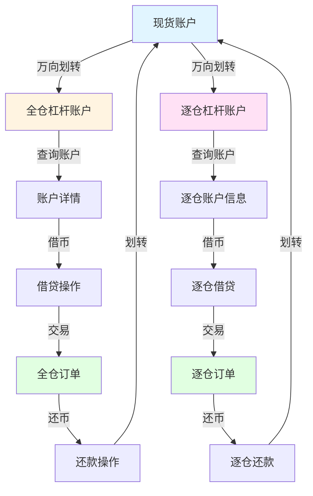

# 币安杠杆交易 API 文档 - AI 上下文

> **项目**: 币安杠杆交易 API 接口分析
> **文档路径**: `/data/downloads/wallet/binance-margin_trading-api-docs/markdown/docs/zh-CN`
> **最后更新**: 2026-02-07

## 📋 项目概述

本文档分析币安杠杆交易 API 的接口依赖关系，帮助 AI 助手快速理解实现杠杆交易所需的接口清单和调用顺序。

**核心模块**:
- `wallet` - 钱包模块（资产管理、充提币、账户信息）
- `margin_trading` - 杠杆交易模块（账户、交易、借贷、市场数据）

## 🎯 杠杆交易类型

### 全仓杠杆 (Cross Margin)
- **特点**: 所有资产共享一个保证金池，风险共担
- **杠杆倍数**: 3x (Classic) / 5x (Classic) / 10x (Pro) / 20x (Pro)
- **风险率**: 全账户统一计算
- **适用场景**: 资金利用率高，适合多币种交易

### 逐仓杠杆 (Isolated Margin)
- **特点**: 每个交易对独立保证金，风险隔离
- **杠杆倍数**: 根据交易对不同（通常 3x-10x）
- **风险率**: 按交易对独立计算
- **适用场景**: 风险可控，适合单一交易对操作

## 🔑 全仓杠杆交易必需接口清单

### 阶段 1: 准备阶段（资金准备）

#### 1.1 查询现货余额
```
POST /sapi/v3/asset/getUserAsset
模块: wallet/asset
权重: 5 (IP)
用途: 确认现货账户有足够资金
注意: 接口为 POST 方法，路径为 v3 版本
```

#### 1.2 划转到全仓杠杆账户
```
POST /sapi/v1/asset/transfer
模块: wallet/asset
权重: 900 (UID)
必需参数: type, asset, amount, timestamp
条件必需参数:
  - fromSymbol: 当 type 为 ISOLATEDMARGIN_MARGIN 或 ISOLATEDMARGIN_ISOLATEDMARGIN 时必需
  - toSymbol: 当 type 为 MARGIN_ISOLATEDMARGIN 或 ISOLATEDMARGIN_ISOLATEDMARGIN 时必需
可选参数: recvWindow
用途: 将现货资金转入全仓杠杆账户
前置条件: API Key 需开通"允许万向划转"权限
```

### 阶段 2: 账户查询（可选但推荐）

#### 2.1 查询全仓账户详情
```
GET /sapi/v1/margin/account
模块: margin_trading/account
权重: 10 (IP)
用途: 查看账户余额、风险率、可用资产
关键返回字段:
  - marginLevel (风险率)
  - borrowEnabled, tradeEnabled (账户开关)
  - accountType (MARGIN_1=Classic, MARGIN_2=Pro)
  - collateralMarginLevel (抵押保证金率)
  - totalAssetOfBtc, totalLiabilityOfBtc (总资产/负债)
  - userAssets[] (各资产详情: free, locked, borrowed, interest)
```

#### 2.2 查询支持的杠杆资产
```
GET /sapi/v1/margin/allAssets
模块: margin_trading/market-data
权重: 1 (IP)
用途: 确认资产是否支持杠杆交易
关键字段: isBorrowable、isCollateral
```

#### 2.3 查询支持的交易对
```
GET /sapi/v1/margin/allPairs
模块: margin_trading/market-data
权重: 1 (IP)
用途: 确认交易对是否支持全仓杠杆
关键字段: isMarginTrade、isBuyAllowed、isSellAllowed
```

### 阶段 3: 借币（如需杠杆）

#### 3.1 查询最大可借额度
```
GET /sapi/v1/margin/maxBorrowable
模块: margin_trading/borrow-and-repay
权重: 50 (IP)
参数: asset, isolatedSymbol (可选)
用途: 确认可借额度，避免借币失败
```

#### 3.2 执行借币
```
POST /sapi/v1/margin/borrow-repay
模块: margin_trading/borrow-and-repay
权重: 1500 (UID)
必需参数: asset, isIsolated, amount, type, timestamp
条件必需参数: symbol (当 isIsolated=TRUE 时必需)
可选参数: recvWindow
用途: 借入资产用于杠杆交易
注意:
  - 开始计息，需定期还款
  - 同一资产不能并发借还操作
  - 建议操作间隔 >100ms
```

### 阶段 4: 交易执行（核心）

#### 4.1 创建杠杆订单
```
POST /sapi/v1/margin/order
模块: margin_trading/trade
权重: 6 (UID)
必需参数: symbol, side, type, timestamp
条件必需参数:
  - quantity 或 quoteOrderQty (二选一)
  - price (限价单必需)
  - stopPrice (止损/止盈单必需)
可选参数:
  - isIsolated (默认 FALSE)
  - sideEffectType (默认 NO_SIDE_EFFECT)
  - timeInForce (GTC/IOC/FOK)
  - newOrderRespType (ACK/RESULT/FULL，默认 FULL)
  - icebergQty (冰山订单数量)
  - selfTradePreventionMode (自成交防止模式)
  - autoRepayAtCancel (撤单后是否自动还款，默认 true)
  - newClientOrderId (客户自定义订单ID)
  - recvWindow
返回字段 (newOrderRespType=FULL 时):
  - marginBuyBorrowAmount, marginBuyBorrowAsset (仅在实际发生借款时返回)
用途: 执行杠杆交易
```

**sideEffectType 详细说明**:

1. **NO_SIDE_EFFECT（普通模式，默认）**
   - 直接使用杠杆账户内的现有资产下单
   - 不自动借款或还款
   - 需要手动调用借贷接口或确保账户余额充足
   - 适用场景：已手动借币或账户有足够余额

2. **MARGIN_BUY（自动借款模式）**
   - 根据最大杠杆倍数，自动借入资产下单
   - 相当于"借款 + 下单"
   - **关键**：下单成功即完成借款，借款与订单成交无关
   - 买单：报价资产不足时自动借入报价资产
   - 卖单：基础资产不足时自动借入基础资产
   - 返回参数包含 `marginBuyBorrowAmount` 和 `marginBuyBorrowAsset`
   - 适用场景：想要一步完成借款和下单

3. **AUTO_REPAY（自动还款模式）**
   - 订单成交后，自动使用收到的资产偿还该资产的负债
   - 相当于"下单 + 订单成交 + 还款"
   - 遵循"先还利息再还本金"原则
   - 仅对借入资产生效
   - **限制**：不适用于 `/sapi/v1/margin/order/otoco` 和 `/sapi/v1/margin/order/oto` 接口
   - 适用场景：平仓后立即还款

4. **AUTO_BORROW_REPAY（同时自动借款和还款）**
   - 结合 MARGIN_BUY 和 AUTO_REPAY 两种模式
   - 相当于"借款 + 下单 + 订单成交 + 还款"
   - 实现"保证金翻转"效果
   - **限制**：不适用于 `/sapi/v1/margin/order/otoco` 和 `/sapi/v1/margin/order/oto` 接口
   - 适用场景：复杂的多腿交易策略

**使用建议**:
- 初学者建议使用 `NO_SIDE_EFFECT`，手动控制借还款
- 简单买入可使用 `MARGIN_BUY` 简化流程
- 平仓时使用 `AUTO_REPAY` 自动还款
- 执行后务必查询账户状态，确认借贷情况

#### 4.2 查询订单状态
```
GET /sapi/v1/margin/order
模块: margin_trading/trade
权重: 2 (IP)
参数: symbol, orderId 或 origClientOrderId
用途: 确认订单执行情况
```

#### 4.3 查询成交记录
```
GET /sapi/v1/margin/myTrades
模块: margin_trading/trade
权重: 10 (IP)
参数: symbol, startTime, endTime
用途: 查看交易历史和成交价格
```

### 阶段 5: 还币（如有借款）

#### 5.1 查询借贷记录
```
GET /sapi/v1/margin/borrow-repay
模块: margin_trading/borrow-and-repay
权重: 10 (IP)
参数: type=BORROW, asset
可选参数: isolatedSymbol, startTime, endTime
用途: 查看当前借款和利息
时间范围限制:
  - 传 asset: 最大 30 天
  - 不传 asset: 最大 7 天
  - 默认返回最近 7 天
```

#### 5.2 执行还币
```
POST /sapi/v1/margin/borrow-repay
模块: margin_trading/borrow-and-repay
权重: 1500 (UID)
必需参数: asset, isIsolated, amount, type, timestamp
条件必需参数: symbol (当 isIsolated=TRUE 时必需)
可选参数: recvWindow
用途: 归还借款和利息
注意: 遵循"先还利息再还本金"原则
```

### 阶段 6: 资金转出

#### 6.1 查询最大可转出额度
```
GET /sapi/v1/margin/maxTransferable
模块: margin_trading/transfer
权重: 50 (IP)
参数: asset, isolatedSymbol (可选)
用途: 确认可转出金额，避免影响风险率
```

#### 6.2 划转回现货账户
```
POST /sapi/v1/asset/transfer
模块: wallet/asset
权重: 900 (UID)
参数: type=MARGIN_MAIN, asset, amount
用途: 将资金转回现货账户
```

## 🔑 逐仓杠杆交易必需接口清单

### 阶段 1: 准备阶段

#### 1.1 查询现货余额
```
POST /sapi/v3/asset/getUserAsset
模块: wallet/asset
权重: 5 (IP)
用途: 确认现货账户有足够资金
注意: 接口为 POST 方法，路径为 v3 版本
```

#### 1.2 划转到逐仓账户（自动激活）
```
POST /sapi/v1/asset/transfer
模块: wallet/asset
权重: 900 (UID)
必需参数: type, asset, amount, timestamp
条件必需参数: toSymbol (交易对，逐仓转入时必需)
可选参数: fromSymbol, recvWindow
用途: 将资金转入指定交易对的逐仓账户
注意: 首次转入会自动激活该交易对的逐仓账户
```

#### 1.3 启用逐仓账户（仅在账户被停用时需要）
```
POST /sapi/v1/margin/isolated/account
模块: margin_trading/account
权重: 300 (UID)
参数: symbol (如 BTCUSDT)
用途: 重新启用之前停用的逐仓账户
注意: 仅支持启用之前停用的账户，首次使用不需要此步骤
```

### 阶段 2: 账户查询

#### 2.1 查询逐仓账户信息
```
GET /sapi/v1/margin/isolated/account
模块: margin_trading/account
权重: 10 (IP)
参数: symbols (可选，最多5个交易对)
用途: 查看逐仓账户余额、风险率
关键返回字段:
  - assets[] (各交易对账户信息)
  - marginLevel (风险率)
  - marginLevelStatus (EXCESSIVE/NORMAL/MARGIN_CALL/PRE_LIQUIDATION/FORCE_LIQUIDATION)
  - marginRatio (保证金率)
  - indexPrice (指数价格)
  - liquidatePrice (强平价格)
  - enabled, tradeEnabled (账户开关)
```

#### 2.2 查询支持的逐仓交易对
```
GET /sapi/v1/margin/isolated/allPairs
模块: margin_trading/market-data
权重: 1 (IP)
用途: 确认交易对是否支持逐仓杠杆
```

### 阶段 3: 借币

#### 3.1 查询最大可借额度
```
GET /sapi/v1/margin/maxBorrowable
模块: margin_trading/borrow-and-repay
权重: 50 (IP)
参数: asset, isolatedSymbol (必需)
用途: 确认该交易对的可借额度
```

#### 3.2 执行借币
```
POST /sapi/v1/margin/borrow-repay
模块: margin_trading/borrow-and-repay
权重: 1500 (UID)
参数: asset, isIsolated=TRUE, symbol (交易对), amount, type=BORROW
用途: 在指定交易对借入资产
```

### 阶段 4: 交易执行

#### 4.1 创建逐仓订单
```
POST /sapi/v1/margin/order
模块: margin_trading/trade
权重: 6 (UID)
参数: symbol, side, type, quantity, price, isIsolated=TRUE
可选参数: sideEffectType
用途: 在逐仓账户执行交易
```

#### 4.2 查询订单状态
```
GET /sapi/v1/margin/order
模块: margin_trading/trade
权重: 2 (IP)
参数: symbol, orderId, isIsolated=TRUE
用途: 确认订单执行情况
```

### 阶段 5: 还币

#### 5.1 查询借贷记录
```
GET /sapi/v1/margin/borrow-repay
模块: margin_trading/borrow-and-repay
权重: 10 (IP)
参数: type=BORROW, asset, isolatedSymbol
用途: 查看该交易对的借款情况
```

#### 5.2 执行还币
```
POST /sapi/v1/margin/borrow-repay
模块: margin_trading/borrow-and-repay
权重: 1500 (UID)
参数: asset, isIsolated=TRUE, symbol, amount, type=REPAY
用途: 归还该交易对的借款
```

### 阶段 6: 资金转出

#### 6.1 查询最大可转出额度
```
GET /sapi/v1/margin/maxTransferable
模块: margin_trading/transfer
权重: 50 (IP)
参数: asset, isolatedSymbol (必需)
用途: 确认该交易对的可转出金额
```

#### 6.2 划转回现货账户
```
POST /sapi/v1/asset/transfer
模块: wallet/asset
权重: 900 (UID)
必需参数: type, asset, amount, timestamp
条件必需参数: fromSymbol (交易对，逐仓转出时必需)
可选参数: recvWindow
用途: 将资金从逐仓转回现货账户
```

## 📊 接口依赖关系图



## 🔗 模块间依赖关系

### wallet → margin_trading
- **资金流入**: `wallet/asset` 的万向划转接口是杠杆交易的资金入口
- **必需参数**:
  - 全仓: `type=MAIN_MARGIN`
  - 逐仓: `type=MAIN_ISOLATED_MARGIN` + `toSymbol`

### margin_trading/account → margin_trading/trade
- **前置条件**:
  - 全仓: 账户需有足够余额或可借额度
  - 逐仓: 需先启用对应交易对的逐仓账户
- **数据流**: 账户余额 → 订单可用额度

### margin_trading/borrow-and-repay → margin_trading/trade
- **借币场景**:
  - 手动借币: 先调用借币接口，再下单
  - 自动借币: 下单时设置 `sideEffectType=MARGIN_BUY`
- **还币场景**:
  - 手动还币: 交易后调用还币接口
  - 自动还币: 下单时设置 `sideEffectType=AUTO_REPAY`

### margin_trading/market-data → 所有模块
- **作用**: 提供交易对配置、资产信息、利率数据
- **调用时机**: 交易前查询，确保资产和交易对可用

## 📝 调用顺序建议

### 全仓杠杆交易完整流程

```
1. [可选] GET /sapi/v1/margin/allAssets - 查询支持的资产
2. [可选] GET /sapi/v1/margin/allPairs - 查询支持的交易对
3. POST /sapi/v3/asset/getUserAsset - 查询现货余额
4. POST /sapi/v1/asset/transfer (MAIN_MARGIN) - 划转到全仓
5. GET /sapi/v1/margin/account - 查询全仓账户
6. [如需借币] GET /sapi/v1/margin/maxBorrowable - 查询可借额度
7. [如需借币] POST /sapi/v1/margin/borrow-repay (BORROW) - 借币
8. POST /sapi/v1/margin/order - 创建订单
9. GET /sapi/v1/margin/order - 查询订单状态
10. [如有借款] POST /sapi/v1/margin/borrow-repay (REPAY) - 还币
11. GET /sapi/v1/margin/maxTransferable - 查询可转出额度
12. POST /sapi/v1/asset/transfer (MARGIN_MAIN) - 划转回现货
```

### 逐仓杠杆交易完整流程

```
1. [可选] GET /sapi/v1/margin/isolated/allPairs - 查询支持的逐仓交易对
2. POST /sapi/v3/asset/getUserAsset - 查询现货余额
3. POST /sapi/v1/asset/transfer (MAIN_ISOLATED_MARGIN) - 划转到逐仓（首次转入自动激活）
4. [仅在账户被停用时] POST /sapi/v1/margin/isolated/account - 重新启用逐仓账户
5. GET /sapi/v1/margin/isolated/account - 查询逐仓账户
6. [如需借币] GET /sapi/v1/margin/maxBorrowable - 查询可借额度
7. [如需借币] POST /sapi/v1/margin/borrow-repay (BORROW) - 借币
8. POST /sapi/v1/margin/order (isIsolated=TRUE) - 创建订单
9. GET /sapi/v1/margin/order - 查询订单状态
10. [如有借款] POST /sapi/v1/margin/borrow-repay (REPAY) - 还币
11. GET /sapi/v1/margin/maxTransferable - 查询可转出额度
12. POST /sapi/v1/asset/transfer (ISOLATED_MARGIN_MAIN) - 划转回现货
```

## 🔔 实时数据推送（WebSocket）

### 为什么使用 WebSocket？

WebSocket 提供实时双向通信，相比 REST API 轮询具有以下优势：
- **实时性**：毫秒级延迟，立即接收账户变化
- **效率高**：减少 API 权重消耗，避免频繁轮询
- **推送机制**：服务器主动推送，无需客户端反复查询

**适用场景**：
- 实时监控账户余额和风险率变化
- 即时接收订单成交和状态更新
- 接收保证金追缴预警通知

### listenKey 管理

#### 创建 listenKey（全仓）
```
POST /sapi/v1/userDataStream
模块: margin_trading/trade-data-stream
权重: 2 (UID)
参数: 无需额外参数（默认全仓）
返回: {"listenKey": "pqia91ma19a5s61cv6a81va65sdf19v8a65a1a5s61cv6a81va65sdf19v8a65a1"}
用途: 创建全仓杠杆账户的 listenKey
有效期: 60 分钟
```

#### 创建 listenKey（逐仓）
```
POST /sapi/v1/userDataStream/isolated
模块: margin_trading/trade-data-stream
权重: 2 (UID)
参数: symbol (交易对，如 BTCUSDT)
返回: {"listenKey": "pqia91ma19a5s61cv6a81va65sdf19v8a65a1a5s61cv6a81va65sdf19v8a65a1"}
用途: 创建逐仓杠杆账户的 listenKey
有效期: 60 分钟
```

#### 延期 listenKey
```
PUT /sapi/v1/userDataStream (全仓)
PUT /sapi/v1/userDataStream/isolated (逐仓)
模块: margin_trading/trade-data-stream
权重: 2 (UID)
参数: listenKey, symbol (仅逐仓需要)
用途: 延长 listenKey 有效期
建议: 每 30 分钟调用一次
```

#### 关闭 listenKey
```
DELETE /sapi/v1/userDataStream (全仓)
DELETE /sapi/v1/userDataStream/isolated (逐仓)
模块: margin_trading/trade-data-stream
权重: 2 (UID)
参数: listenKey, symbol (仅逐仓需要)
用途: 关闭用户数据流
```

#### 订阅用户数据流
```
WebSocket 连接: wss://stream.binance.com:9443/ws/<listenKey>
用途: 订阅账户更新、订单更新、风险通知
```

### 推送事件类型

#### 1. 账户余额更新（outboundAccountPosition）
**触发时机**：
- 账户余额发生变化
- 借贷操作完成
- 资金划转完成

**关键字段**：
- `e`: 事件类型（outboundAccountPosition）
- `E`: 事件时间
- `B`: 余额数组（包含 free、locked、borrowed 等）

#### 2. 订单更新（executionReport）
**触发时机**：
- 订单创建、成交、取消
- 订单状态变化

**关键字段**：
- `e`: 事件类型（executionReport）
- `s`: 交易对
- `X`: 订单状态（NEW、FILLED、CANCELED 等）
- `x`: 执行类型（NEW、TRADE、CANCELED 等）
- `q`: 订单数量
- `z`: 已成交数量

#### 3. 保证金追缴通知（MARGIN_CALL）
**触发时机**：
- 风险率低于警戒线
- 接近强平风险

**关键字段**：
- `e`: 事件类型（MARGIN_CALL）
- `E`: 事件时间
- `cw`: 全仓钱包余额
- `p`: 持仓信息

### 使用建议

**何时使用 WebSocket**：
- 需要实时监控账户余额和风险率（秒级更新）
- 需要即时接收订单成交通知
- 需要接收保证金追缴预警
- 高频交易场景

**何时使用 REST API**：
- 一次性查询历史数据
- 低频率的状态查询（如每分钟一次）
- 初始化时获取完整账户状态
- 连接断开后同步最新状态

### 关键注意事项

1. **连接限制**：
   - 每秒最多 5 个消息（包括 PING/PONG 帧）
   - 单连接最多订阅 1024 个 Streams
   - 每 IP 每 5 分钟最多 300 次连接请求

2. **listenKey 管理**：
   - listenKey 有效期 60 分钟
   - 需要定期续期（建议每 30 分钟续期一次）
   - 过期后会自动断开连接

3. **与 REST API 配合**：
   - WebSocket 用于实时推送，REST API 用于主动查询
   - 连接断开后使用 REST API 同步最新状态
   - 建议同时使用两种方式确保数据完整性

4. **断线重连**：
   - 检测到连接断开后立即重连
   - 重连后重新创建 listenKey
   - 使用 REST API 同步期间错过的数据

## 📋 交易对配置查询（exchangeInfo）

### 接口说明

```
GET /api/v3/exchangeInfo
模块: 现货市场数据（适用于杠杆交易）
权重: 20 (IP)
参数: symbol (可选，查询单个交易对)
用途: 查询交易对配置、过滤器规则、交易限制
必需性: 推荐（下单前查询，避免参数错误）
```

### 使用场景

1. **下单前验证**：
   - 确认交易对是否支持杠杆交易
   - 获取价格、数量、金额的最小/最大限制
   - 确认支持的订单类型

2. **参数校验**：
   - 根据 filters 校验订单参数
   - 避免因参数不符合规则导致下单失败

3. **权限检查**：
   - 确认账户是否有交易权限
   - 确认交易对当前是否可交易

### 关键返回字段

#### isMarginTradingAllowed
- **类型**: Boolean
- **说明**: 是否支持杠杆交易
- **用途**: 确认交易对是否可用于全仓/逐仓杠杆

#### filters（过滤器）

1. **PRICE_FILTER**：
   - `minPrice`: 最小价格
   - `maxPrice`: 最大价格
   - `tickSize`: 价格步进

2. **LOT_SIZE**：
   - `minQty`: 最小数量
   - `maxQty`: 最大数量
   - `stepSize`: 数量步进

3. **NOTIONAL**：
   - `minNotional`: 最小成交金额
   - `maxNotional`: 最大成交金额
   - 计算公式: price × quantity ≥ minNotional

4. **MARKET_LOT_SIZE**：
   - 市价单的数量限制
   - `minQty`: 最小数量
   - `maxQty`: 最大数量

#### orderTypes
- **说明**: 支持的订单类型列表
- **常见类型**: LIMIT, MARKET, STOP_LOSS, STOP_LOSS_LIMIT, TAKE_PROFIT, TAKE_PROFIT_LIMIT

#### permissions / permissionSets
- **说明**: 交易对的交易权限
- **常见值**: SPOT, MARGIN
- **用途**: 确认是否支持杠杆交易

### 调用时机

**推荐调用时机**：
1. 应用启动时：缓存所有交易对配置
2. 下单前：验证订单参数是否符合规则
3. 定期更新：每小时或每天更新一次缓存

**不推荐**：
- 每次下单前都调用（浪费权重）
- 不缓存配置信息（增加延迟）

### 关键注意事项

1. **配置缓存**：
   - 建议缓存 exchangeInfo 结果，避免频繁查询
   - 缓存时间建议 1-24 小时
   - 下单失败时重新查询最新配置

2. **参数精度**：
   - 价格和数量必须符合 tickSize 和 stepSize
   - 使用 Decimal 类型避免浮点数精度问题
   - 示例: `price = round(price / tickSize) * tickSize`

3. **动态规则**：
   - 交易对配置可能随时变化
   - 下单失败时检查是否因配置变更
   - 关注币安公告了解规则调整

4. **与杠杆接口配合**：
   - exchangeInfo 提供通用配置
   - `GET /sapi/v1/margin/allPairs` 提供杠杆专属配置
   - 两者结合使用获取完整信息

## ⚠️ 关键注意事项

### 权限要求
1. **API Key 权限**: 必须开通"允许万向划转"权限
2. **交易权限**: 需开通"允许现货和杠杆交易"权限
3. **账户状态**: 账户需完成 KYC 认证

### 风险控制
1. **风险率监控**:
   - 全仓: `marginLevel` < 1.3 会被强平
   - 逐仓: 每个交易对独立计算风险率
2. **借币利息**: 按小时计息，每日结算
3. **强平机制**: 风险率过低时系统自动平仓

### 接口限制
1. **频率限制**:
   - 借贷操作: 权重 1500，建议间隔 100ms
   - 万向划转: 权重 900，避免频繁调用
   - 下单: 权重 6，注意订单频率限制
2. **并发限制**: 同一资产的借还操作不能并发

### 数据一致性
1. **余额更新**: 借贷、交易后余额可能有延迟（通常 < 100ms）
2. **订单状态**: 使用 WebSocket 获取实时订单更新
3. **风险率计算**: 基于实时价格，波动较大时需频繁查询

## 📚 模块索引

### wallet 模块
- [asset](markdown/docs/zh-CN/wallet/asset/CLAUDE.md) - 资产管理（万向划转、小额资产转换）
- [account](markdown/docs/zh-CN/wallet/account/CLAUDE.md) - 账户信息
- [capital](markdown/docs/zh-CN/wallet/capital/CLAUDE.md) - 充提币管理
- [travel-rule](markdown/docs/zh-CN/wallet/travel-rule/CLAUDE.md) - 旅行规则合规
- [others](markdown/docs/zh-CN/wallet/others/CLAUDE.md) - 其他功能

### margin_trading 模块
- [account](markdown/docs/zh-CN/margin_trading/account/CLAUDE.md) - 账户管理（全仓/逐仓账户查询）
- [trade](markdown/docs/zh-CN/margin_trading/trade/CLAUDE.md) - 交易执行（订单管理）
- [borrow-and-repay](markdown/docs/zh-CN/margin_trading/borrow-and-repay/CLAUDE.md) - 借贷还款
- [transfer](markdown/docs/zh-CN/margin_trading/transfer/CLAUDE.md) - 杠杆账户划转历史
- [market-data](markdown/docs/zh-CN/margin_trading/market-data/CLAUDE.md) - 市场数据
- [trade-data-stream](markdown/docs/zh-CN/margin_trading/trade-data-stream/CLAUDE.md) - 交易数据流
- [risk-data-stream](markdown/docs/zh-CN/margin_trading/risk-data-stream/CLAUDE.md) - 风险数据流

## 🔍 快速查询

### 我想实现全仓杠杆交易

**核心必需接口**（最少 3 个）:
1. `POST /sapi/v1/asset/transfer` (MAIN_MARGIN) - 划转资金到杠杆账户
2. `POST /sapi/v1/margin/order` (isIsolated=FALSE, sideEffectType=AUTO_BORROW_REPAY) - 交易（自动借还款）
3. `POST /sapi/v1/asset/transfer` (MARGIN_MAIN) - 划转资金回现货账户

**手动借还款模式**（需要 5 个接口）:
1. `POST /sapi/v1/asset/transfer` (MAIN_MARGIN) - 划转
2. `POST /sapi/v1/margin/borrow-repay` (BORROW) - 手动借币
3. `POST /sapi/v1/margin/order` (isIsolated=FALSE, sideEffectType=NO_SIDE_EFFECT) - 交易
4. `POST /sapi/v1/margin/borrow-repay` (REPAY) - 手动还币
5. `POST /sapi/v1/asset/transfer` (MARGIN_MAIN) - 转出

**推荐接口**:
- `GET /sapi/v1/margin/account` - 查询账户状态和风险率
- `GET /sapi/v1/margin/maxBorrowable` - 查询可借额度（手动借款时需要）

### 我想实现逐仓杠杆交易

**核心必需接口**（最少 3 个）:
1. `POST /sapi/v1/asset/transfer` (MAIN_ISOLATED_MARGIN) - 划转到逐仓（首次转入自动激活）
2. `POST /sapi/v1/margin/order` (isIsolated=TRUE, sideEffectType=AUTO_BORROW_REPAY) - 交易（自动借还款）
3. `POST /sapi/v1/asset/transfer` (ISOLATED_MARGIN_MAIN) - 划转回现货

**手动借还款模式**（需要 5 个接口）:
1. `POST /sapi/v1/asset/transfer` (MAIN_ISOLATED_MARGIN) - 划转（首次转入自动激活）
2. `POST /sapi/v1/margin/borrow-repay` (BORROW, isIsolated=TRUE) - 手动借币
3. `POST /sapi/v1/margin/order` (isIsolated=TRUE, sideEffectType=NO_SIDE_EFFECT) - 交易
4. `POST /sapi/v1/margin/borrow-repay` (REPAY, isIsolated=TRUE) - 手动还币
5. `POST /sapi/v1/asset/transfer` (ISOLATED_MARGIN_MAIN) - 转出

**推荐接口**:
- `GET /sapi/v1/margin/isolated/account` - 查询逐仓账户状态和风险率
- `GET /sapi/v1/margin/maxBorrowable` - 查询可借额度（手动借款时需要）

**仅在特殊情况下需要**:
- `POST /sapi/v1/margin/isolated/account` - 重新启用之前停用的逐仓账户

### 我想查询账户状态
- 全仓: `GET /sapi/v1/margin/account`
- 逐仓: `GET /sapi/v1/margin/isolated/account`
- 现货: `POST /sapi/v3/asset/getUserAsset`

### 我想查询借贷记录
- `GET /sapi/v1/margin/borrow-repay` (type=BORROW)
- `GET /sapi/v1/margin/interestHistory` - 利息历史

### 我想查询交易记录
- `GET /sapi/v1/margin/myTrades` - 成交记录
- `GET /sapi/v1/margin/allOrders` - 所有订单
- `GET /sapi/v1/margin/openOrders` - 当前挂单

### 我想实时监控账户状态

**WebSocket 方式（推荐）**:
1. `POST /sapi/v1/userDataStream` - 创建 listenKey（全仓）
2. `POST /sapi/v1/userDataStream/isolated` - 创建 listenKey（逐仓）
3. 连接 WebSocket: `wss://stream.binance.com:9443/ws/<listenKey>`
4. 接收实时推送：账户余额、订单更新、风险通知

**REST API 轮询方式**:
- 全仓: `GET /sapi/v1/margin/account` - 定期查询账户状态
- 逐仓: `GET /sapi/v1/margin/isolated/account` - 定期查询账户状态

**使用建议**:
- 高频监控（秒级）：使用 WebSocket
- 低频监控（分钟级）：使用 REST API 轮询
- 关键操作后：使用 REST API 主动查询确认

### 我想查询交易对配置

**必需接口**:
- `GET /api/v3/exchangeInfo` - 查询交易对配置和过滤器规则

**推荐接口**:
- `GET /sapi/v1/margin/allPairs` - 查询杠杆交易对专属配置
- `GET /sapi/v1/margin/allAssets` - 查询杠杆资产配置

**调用时机**:
- 应用启动时缓存配置
- 下单前验证参数
- 下单失败时重新查询

---

**文档版本**: 1.0
**生成时间**: 2026-02-07
**适用范围**: 币安杠杆交易 API v1
