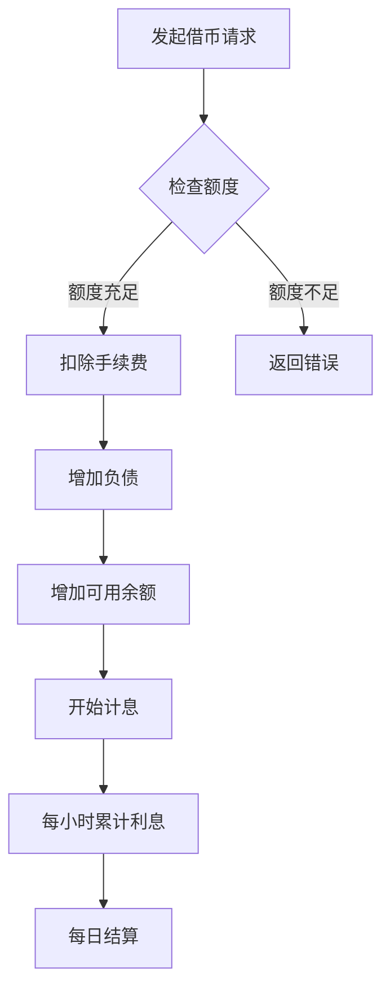

# 借贷还款模块 - AI 上下文

**导航**: [根目录](../../../../../CLAUDE.md) > [margin_trading](../../CLAUDE.md) > borrow-and-repay

## 📍 模块定位

借贷还款模块是杠杆交易的资金基础，提供借币、还币、利率查询等核心功能。

## 🔌 接口清单

### 借贷操作
- `Margin-Account-Borrow-Repay.md` - 杠杆账户借贷还款（统一接口）

### 借贷查询
- `Query-Borrow-Repay.md` - 查询借贷还款记录
- `Query-Max-Borrow.md` - 查询最大可借额度

### 利率查询
- `Query-Margin-Interest-Rate-History.md` - 查询利率历史
- `Get-Interest-History.md` - 获取利息历史
- `Get-a-future-hourly-interest-rate.md` - 获取未来小时利率

## 🔗 依赖关系

### 上游依赖
- **账户模块**: 需要账户余额作为抵押
- **市场数据**: 资产价格用于计算抵押率

### 下游影响
- 影响账户可用余额
- 影响风险率计算
- 触发利息计算

## 📊 接口特征

### 操作类型
- **BORROW**: 借币
- **REPAY**: 还币

### 账户类型
- **ISOLATED**: 逐仓（针对特定交易对）
- **CROSS**: 全仓（共享保证金池）

### 权重分布
- 借贷操作: 1500 权重
- 查询记录: 10 权重
- 查询利率: 1-10 权重

### 访问限制
- 借贷操作: 严格频率限制
- 查询接口: 相对宽松

## 🧪 测试要点

### 功能测试
- 借币成功后余额变化
- 还币后负债减少
- 最大可借额度计算准确性
- 利率查询实时性

### 边界测试
- 超过最大可借额度
- 还币金额超过负债
- 零额度借贷请求

### 异常场景
- 抵押不足
- 资产不支持借贷
- 账户被限制借贷

## 📝 使用示例

### 借币
```bash
POST /sapi/v1/margin/borrow-repay
asset=USDT&isIsolated=FALSE&symbol=BTCUSDT&amount=1000&type=BORROW
```

### 还币
```bash
POST /sapi/v1/margin/borrow-repay
asset=USDT&isIsolated=FALSE&symbol=BTCUSDT&amount=1000&type=REPAY
```

### 查询最大可借
```bash
GET /sapi/v1/margin/maxBorrowable?asset=USDT
```

## ⚠️ 注意事项

1. **利息计算**: 按小时计息，每日结算
2. **风险控制**: 借币会降低账户风险率，注意爆仓风险
3. **还币顺序**: 建议优先还清高利率资产
4. **自动还币**: 部分场景下系统会自动还币（如卖出借入资产）

## 💰 利息机制

### 计息规则
- 按小时计息
- 不足一小时按一小时计算
- 每日 00:00 UTC 结算

### 利率类型
- **基础利率**: 根据市场供需动态调整
- **VIP 等级**: 不同等级享受不同利率折扣
- **小时利率**: 年化利率 / 365 / 24

### 利息支付
- 自动从账户余额扣除
- 余额不足时计入负债
- 可通过还币接口主动还息

## 📈 风险管理

### 抵押率计算
```
抵押率 = 总资产价值 / 总负债价值
```

### 风险等级
- **安全**: 抵押率 > 2.0
- **警告**: 1.5 < 抵押率 < 2.0
- **危险**: 1.3 < 抵押率 < 1.5
- **强平**: 抵押率 < 1.3

### 建议策略
- 保持抵押率在 2.0 以上
- 设置价格预警
- 定期检查负债情况
- 及时追加保证金或还币

## 🔄 借贷流程



---

**文件数量**: 6
**有效文件**: 6
**最后更新**: 2026-02-07
