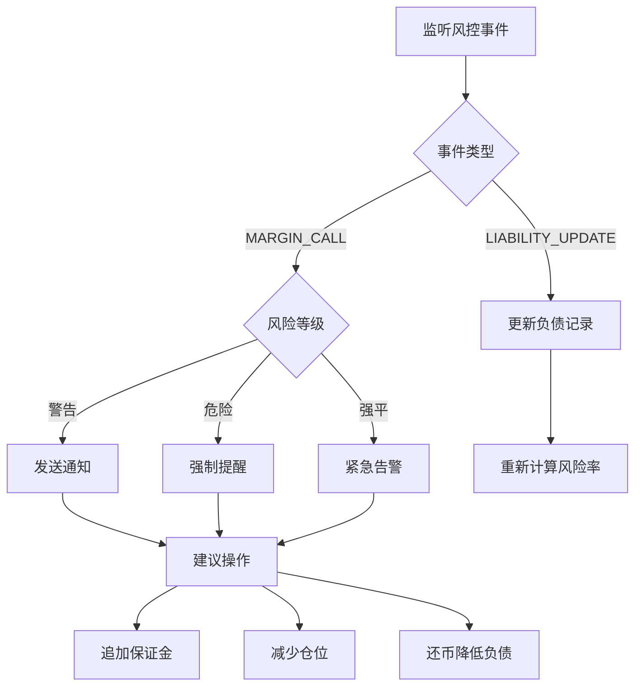

# 风控数据推送模块 - AI 上下文

**导航**: [根目录](../../../../../CLAUDE.md) > [margin_trading](../../CLAUDE.md) > risk-data-stream

## 📍 模块定位

风控数据推送模块通过 WebSocket 实时推送杠杆账户的风险事件，包括追加保证金通知和负债更新。

## 🔌 接口清单

### 连接管理
- `Start-User-Data-Stream.md` - 启动用户数据流
- `Keepalive-User-Data-Stream.md` - 保持用户数据流活跃
- `Close-User-Data-Stream.md` - 关闭用户数据流
- `Connect.md` - 连接说明（⚠️ 空文件）

### 风控事件
- `Event-Margin-Call.md` - 追加保证金事件
- `Event-Liability-Update.md` - 负债更新事件

## 🔗 依赖关系

### 上游依赖
- **账户模块**: 风险率计算
- **市场数据**: 实时价格用于风险评估
- **借贷模块**: 负债数据

### 下游影响
- 触发风险预警
- 提示用户追加保证金
- 防止强制平仓

## 📊 事件类型

### MARGIN_CALL
追加保证金通知，当账户风险率低于维持保证金率时触发

**风险等级**:
- 警告: 风险率 < 1.5
- 危险: 风险率 < 1.3
- 强平: 风险率 < 1.1

### LIABILITY_UPDATE
负债更新事件，当借贷负债发生变化时触发

**触发场景**:
- 借币操作
- 还币操作
- 利息计算
- 自动还币

## 🧪 测试要点

### 连接测试
- listenKey 创建和管理
- WebSocket 连接稳定性
- 心跳保活机制

### 事件测试
- 追加保证金通知准确性
- 负债更新实时性
- 风险阈值触发正确性

### 异常场景
- listenKey 过期处理
- 连接中断恢复
- 极端行情下的推送延迟

## 📝 使用示例

### 创建 listenKey
```bash
POST /sapi/v1/margin/listen-key
```

### 连接 WebSocket
```javascript
const listenKey = 'your_listen_key';
const ws = new WebSocket(`wss://stream.binance.com:9443/ws/${listenKey}`);

ws.onmessage = (event) => {
  const data = JSON.parse(event.data);

  if (data.e === 'MARGIN_CALL') {
    // 处理追加保证金通知
    console.warn('风险警告:', data);
    // 发送告警通知
  } else if (data.e === 'LIABILITY_UPDATE') {
    // 处理负债更新
    console.log('负债更新:', data);
  }
};
```

### 追加保证金事件
```json
{
  "e": "MARGIN_CALL",
  "E": 1564034571105,
  "cw": "10000.00000000",
  "p": [
    {
      "s": "BTCUSDT",
      "ps": "LONG",
      "pa": "1.00000000",
      "mt": "CROSSED",
      "iw": "0",
      "mp": "50000.00",
      "up": "-500.00",
      "mm": "200.00"
    }
  ]
}
```

### 负债更新事件
```json
{
  "e": "LIABILITY_UPDATE",
  "E": 1564034571105,
  "a": "BTC",
  "l": "0.50000000",
  "i": "0.00001000"
}
```

## ⚠️ 注意事项

1. **空文件警告**: `Connect.md` 为空
2. **listenKey 管理**: 需每 30 分钟续期一次
3. **风险响应**: 收到 MARGIN_CALL 应立即处理
4. **多账户**: 全仓和逐仓需分别订阅
5. **延迟容忍**: 极端行情可能有推送延迟

## 🚨 风险处理流程



## 📈 风险管理策略

### 预警机制
- **一级预警**: 风险率 < 2.0，发送邮件通知
- **二级预警**: 风险率 < 1.5，发送短信通知
- **三级预警**: 风险率 < 1.3，电话告警

### 自动化处理
- 设置止损订单
- 自动追加保证金
- 自动减仓保护

### 监控指标
- 实时风险率
- 负债总额
- 可用保证金
- 未实现盈亏

## 🔄 连接管理

### listenKey 生命周期
```bash
# 1. 创建 listenKey
POST /sapi/v1/margin/listen-key

# 2. 每 30 分钟续期
PUT /sapi/v1/margin/listen-key

# 3. 关闭时删除
DELETE /sapi/v1/margin/listen-key
```

### 心跳保活
- 服务端每 3 分钟发送 ping
- 客户端需响应 pong
- 超时未响应则断开连接

### 重连策略
- 指数退避重连（1s, 2s, 4s, 8s...）
- 最大重连间隔 60 秒
- 重连后重新订阅

## 🔐 安全建议

1. **listenKey 保护**: 定期轮换，不要共享
2. **连接加密**: 仅使用 WSS 协议
3. **IP 白名单**: 限制连接来源 IP
4. **异常检测**: 监控异常推送模式

## 📊 监控告警

| 监控项 | 阈值 | 处理方式 |
|--------|------|---------|
| 风险率 | < 1.5 | 邮件通知 |
| 风险率 | < 1.3 | 短信告警 |
| 风险率 | < 1.1 | 电话告警 |
| 连接中断 | > 3 次/小时 | 技术告警 |
| 推送延迟 | > 5 秒 | 性能告警 |

---

**文件数量**: 6
**有效文件**: 5
**空文件**: 1
**最后更新**: 2026-02-07
