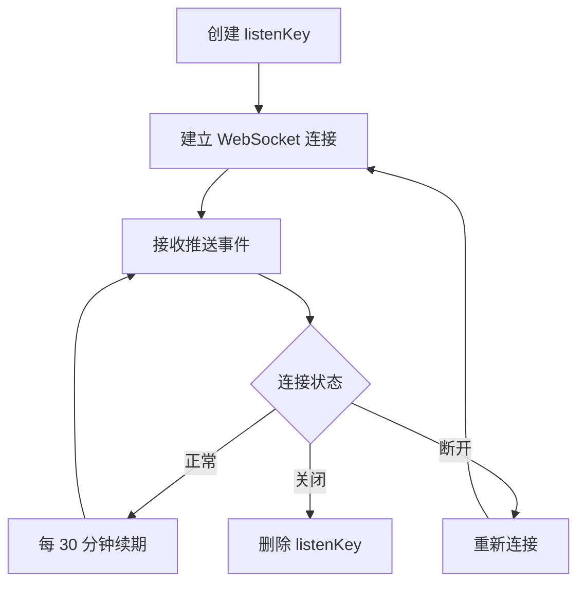

# 账户数据推送模块 - AI 上下文

**导航**: [根目录](../../../../../CLAUDE.md) > [margin_trading](../../CLAUDE.md) > trade-data-stream

## 📍 模块定位

账户数据推送模块通过 WebSocket 实时推送账户变化、订单更新和余额变动事件。

## 🔌 接口清单

### WebSocket 连接
- `Listen-Token-Websocket-API.md` - 监听令牌 WebSocket API（⚠️ 空文件）

### 推送事件
- `Event-Account-Update.md` - 账户更新事件
- `Event-Order-Update.md` - 订单更新事件
- `Event-Balance-Update.md` - 余额更新事件

## 🔗 依赖关系

### 上游依赖
- **用户数据流**: 需要先创建 listenKey
- **交易模块**: 订单变化触发推送
- **账户模块**: 余额变化触发推送

### 下游影响
- 为客户端提供实时数据
- 减少轮询查询压力
- 提高数据时效性

## 📊 事件类型

### outboundAccountPosition
账户位置更新，包含所有资产余额变化

**触发场景**:
- 充值/提现
- 交易成交
- 借贷还款
- 利息结算

### executionReport
订单执行报告，包含订单状态变化

**触发场景**:
- 订单创建
- 订单成交（部分/完全）
- 订单取消
- 订单拒绝

### balanceUpdate
余额更新事件，单个资产余额变化

**触发场景**:
- 交易手续费扣除
- 资金划转
- 利息扣除

## 🧪 测试要点

### 连接测试
- listenKey 创建和续期
- WebSocket 连接稳定性
- 断线重连机制

### 事件测试
- 各类事件触发准确性
- 事件顺序正确性
- 数据完整性

### 异常场景
- listenKey 过期处理
- 网络中断恢复
- 消息丢失检测

## 📝 使用示例

### 连接 WebSocket
```javascript
const ws = new WebSocket('wss://stream.binance.com:9443/ws/' + listenKey);

ws.onmessage = (event) => {
  const data = JSON.parse(event.data);

  if (data.e === 'outboundAccountPosition') {
    // 处理账户更新
  } else if (data.e === 'executionReport') {
    // 处理订单更新
  } else if (data.e === 'balanceUpdate') {
    // 处理余额更新
  }
};
```

### 账户更新事件
```json
{
  "e": "outboundAccountPosition",
  "E": 1564034571105,
  "u": 1564034571073,
  "B": [
    {
      "a": "BTC",
      "f": "10.00000000",
      "l": "0.00000000"
    }
  ]
}
```

### 订单更新事件
```json
{
  "e": "executionReport",
  "E": 1564034571105,
  "s": "BTCUSDT",
  "c": "myOrderId",
  "S": "BUY",
  "o": "LIMIT",
  "q": "1.00000000",
  "p": "50000.00",
  "X": "FILLED",
  "i": 12345678,
  "l": "1.00000000",
  "z": "1.00000000",
  "n": "0.00100000",
  "N": "BTC"
}
```

## ⚠️ 注意事项

1. **空文件警告**: `Listen-Token-Websocket-API.md` 为空
2. **listenKey 有效期**: 60 分钟，需定期续期
3. **连接限制**: 每个账户最多 5 个连接
4. **消息顺序**: 不保证严格顺序，需客户端处理
5. **重复消息**: 可能收到重复事件，需去重处理

## 🔄 连接生命周期



## 📈 性能优化

### 连接管理
- 使用连接池复用连接
- 实现自动重连机制
- 监控连接健康状态

### 数据处理
- 异步处理推送事件
- 实现消息队列缓冲
- 批量处理相同类型事件

### 错误处理
- 记录异常事件
- 实现降级策略
- 定期对账校验

## 🔐 安全建议

1. **listenKey 保护**: 不要泄露 listenKey
2. **连接加密**: 使用 WSS 协议
3. **数据校验**: 验证推送数据签名
4. **访问控制**: 限制 WebSocket 连接来源

## 📊 监控指标

| 指标 | 说明 | 告警阈值 |
|------|------|---------|
| 连接延迟 | WebSocket 延迟 | > 1000ms |
| 消息延迟 | 事件时间戳差异 | > 500ms |
| 断线次数 | 每小时断线次数 | > 3 次 |
| 消息丢失率 | 对账差异比例 | > 0.1% |

---

**文件数量**: 4
**有效文件**: 3
**空文件**: 1
**最后更新**: 2026-02-07
