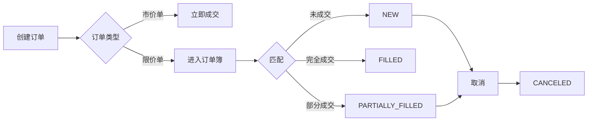

# 交易模块 - AI 上下文

**导航**: [根目录](../../../../../CLAUDE.md) > [margin_trading](../../CLAUDE.md) > trade

## 📍 模块定位

交易模块是杠杆交易的核心，提供订单创建、取消、查询以及特殊交易功能。

## 🔌 接口清单

### 订单管理
- `Margin-Account-New-Order.md` - 创建新订单
- `Margin-Account-Cancel-Order.md` - 取消订单
- `Margin-Account-Cancel-All-Open-Orders.md` - 取消所有挂单

### OCO 订单（One-Cancels-the-Other）
- `Margin-Account-New-OCO.md` - 创建 OCO 订单
- `Margin-Account-Cancel-OCO.md` - 取消 OCO 订单
- `Query-Margin-Account-OCO.md` - 查询 OCO 订单
- `Query-Margin-Account-All-OCO.md` - 查询所有 OCO 订单
- `Query-Margin-Account-Open-OCO.md` - 查询挂单 OCO

### OTO/OTOCO 订单
- `Margin-Account-New-OTO.md` - 创建 OTO 订单（One-Triggers-the-Other）
- `Margin-Account-New-OTOCO.md` - 创建 OTOCO 订单

### 订单查询
- `Query-Margin-Account-Order.md` - 查询单个订单
- `Query-Margin-Account-All-Orders.md` - 查询所有订单
- `Query-Margin-Account-Open-Orders.md` - 查询当前挂单
- `Query-Margin-Account-Trade-List.md` - 查询成交历史

### 小额负债兑换
- `Small-Liability-Exchange.md` - 小额负债兑换
- `Get-Small-Liability-Exchange-Coin-List.md` - 获取可兑换币种列表
- `Get-Small-Liability-Exchange-History.md` - 获取兑换历史

### 强制平仓
- `Margin-Manual-Liquidation.md` - 手动平仓
- `Get-Force-Liquidation-Record.md` - 获取强平记录

### 低延迟交易密钥
- `Create-Special-Key-of-Low-Latency-Trading.md` - 创建特殊密钥
- `Delete-Special-Key-of-Low-Latency-Trading.md` - 删除特殊密钥
- `Query-Special-Key-of-Low-Latency-Trading.md` - 查询特殊密钥
- `Query-Special-Key-List-of-Low-Latency-Trading.md` - 查询密钥列表
- `Edit-ip-for-Special-Key-of-Low-Latency-Trading.md` - 编辑密钥 IP

### 限流查询
- `Query-Current-Margin-Order-Count-Usage.md` - 查询当前订单计数使用情况

## 🔗 依赖关系

### 上游依赖
- **账户模块**: 需要足够的可用余额
- **借贷模块**: 杠杆交易需要借贷支持
- **市场数据**: 价格、交易对信息

### 下游影响
- 触发账户余额变化
- 影响借贷额度
- 触发 WebSocket 推送事件

## 📊 接口特征

### 订单类型
- LIMIT - 限价单
- MARKET - 市价单
- STOP_LOSS - 止损单
- STOP_LOSS_LIMIT - 限价止损单
- TAKE_PROFIT - 止盈单
- TAKE_PROFIT_LIMIT - 限价止盈单

### 权重分布
- 下单: 6-12 权重
- 取消订单: 10 权重
- 查询订单: 2-10 权重
- 批量操作: 1-200 权重

### 访问限制
- 订单频率限制（RAW_REQUESTS）
- 每日订单数量限制
- IP 访问频率限制

## 🧪 测试要点

### 功能测试
- 各类订单类型的创建和执行
- OCO/OTO/OTOCO 组合订单逻辑
- 订单取消和查询准确性

### 边界测试
- 最小/最大订单数量
- 价格精度限制
- 订单数量限制

### 异常场景
- 余额不足
- 价格超出限制
- 频率限制触发
- 交易对暂停交易

## 📝 使用示例

### 创建限价单
```bash
POST /sapi/v1/margin/order
symbol=BTCUSDT&side=BUY&type=LIMIT&quantity=0.01&price=50000
```

### 创建 OCO 订单
```bash
POST /sapi/v1/margin/order/oco
symbol=BTCUSDT&side=SELL&quantity=0.01&price=55000&stopPrice=45000
```

### 查询挂单
```bash
GET /sapi/v1/margin/openOrders?symbol=BTCUSDT
```

## ⚠️ 注意事项

1. **订单限制**: 注意每日订单数量和频率限制
2. **价格精度**: 不同交易对有不同的价格和数量精度要求
3. **杠杆风险**: 杠杆交易风险较高，注意风险控制
4. **小额负债**: 建议定期清理小额负债，避免利息累积

## 🔄 订单生命周期



## 📈 性能优化

### 低延迟交易
- 使用特殊密钥减少签名开销
- 配置 IP 白名单提高安全性
- 适用于高频交易场景

### 批量操作
- 使用批量取消接口减少请求次数
- 合理使用查询接口的分页参数
- 避免频繁查询所有订单

---

**文件数量**: 26
**有效文件**: 26
**最后更新**: 2026-02-07
