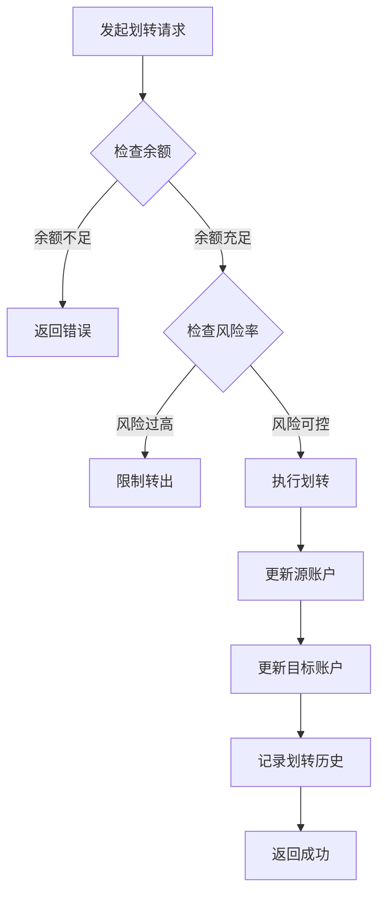

# 资金划转模块 - AI 上下文

**导航**: [根目录](../../../../../CLAUDE.md) > [margin_trading](../../CLAUDE.md) > transfer

## 📍 模块定位

资金划转模块提供杠杆账户与其他账户之间的资金转移功能，是资金管理的重要组成部分。

## 🔌 接口清单

### 划转操作
- `Get-Cross-Margin-Transfer-History.md` - 获取全仓划转历史

### 额度查询
- `Query-Max-Transfer-Out-Amount.md` - 查询最大可转出金额

## 🔗 依赖关系

### 上游依赖
- **账户模块**: 需要账户余额数据
- **风控系统**: 需要风险率检查

### 下游影响
- 影响账户可用余额
- 影响风险率计算
- 可能触发风险预警

## 📊 接口特征

### 划转类型
- **MAIN_MARGIN**: 现货账户 ↔ 全仓杠杆账户
- **MAIN_ISOLATED_MARGIN**: 现货账户 ↔ 逐仓杠杆账户
- **ISOLATED_MARGIN_MARGIN**: 逐仓 ↔ 全仓

### 权重分布
- 划转操作: 600 权重
- 查询历史: 1 权重
- 查询额度: 50 权重

### 访问限制
- 划转操作有频率限制
- 需要 USER_DATA 权限

## 🧪 测试要点

### 功能测试
- 不同账户间划转成功
- 最大可转出金额计算准确
- 划转历史记录完整

### 边界测试
- 超过最大可转出金额
- 零金额划转
- 不支持的资产划转

### 异常场景
- 账户余额不足
- 风险率过低限制转出
- 资产被冻结

## 📝 使用示例

### 查询最大可转出
```bash
GET /sapi/v1/margin/maxTransferable?asset=USDT
```

### 响应示例
```json
{
  "amount": "1000.00000000",
  "borrowEnabled": true
}
```

## ⚠️ 注意事项

1. **风险限制**: 转出可能受风险率限制
2. **借贷影响**: 有负债时转出额度受限
3. **实时性**: 划转立即生效，但可能有延迟
4. **手续费**: 内部划转通常免手续费

## 💡 最大可转出计算

### 全仓账户
```
最大可转出 = (总资产 - 总负债 × 初始保证金率) / (1 + 初始保证金率)
```

### 逐仓账户
```
最大可转出 = 净资产 - (负债 × 初始保证金率)
```

### 限制条件
- 必须保持风险率 > 初始保证金率
- 不能转出借入的资产
- 冻结资产不可转出

## 🔄 划转流程



## 📈 使用场景

### 场景 1: 追加保证金
```bash
# 从现货账户转入杠杆账户
# 降低风险率，避免强平
```

### 场景 2: 提取盈利
```bash
# 从杠杆账户转出到现货账户
# 锁定利润，降低风险敞口
```

### 场景 3: 账户调整
```bash
# 在全仓和逐仓之间调配资金
# 优化资金使用效率
```

## 🔐 安全建议

1. **划转确认**: 重要划转需二次确认
2. **额度检查**: 划转前先查询最大可转出
3. **风险监控**: 划转后检查风险率变化
4. **日志记录**: 保存所有划转记录用于对账

## 📊 监控指标

| 指标 | 说明 | 建议阈值 |
|------|------|---------|
| 划转成功率 | 成功次数/总次数 | > 99% |
| 划转延迟 | 请求到到账时间 | < 1 秒 |
| 风险率变化 | 划转前后风险率差异 | 监控异常波动 |
| 日划转次数 | 每日划转操作次数 | 设置合理上限 |

## 🛠️ 最佳实践

### 划转前检查
1. 查询最大可转出金额
2. 计算划转后的风险率
3. 确认目标账户状态

### 划转后验证
1. 检查账户余额变化
2. 验证划转历史记录
3. 监控风险率变化

### 异常处理
1. 划转失败重试机制
2. 超时处理策略
3. 对账校验流程

## 📋 常见问题

**Q: 为什么无法转出全部余额？**
A: 需要保留足够的保证金维持风险率，有负债时转出受限。

**Q: 划转需要手续费吗？**
A: 内部账户间划转通常免手续费。

**Q: 划转多久到账？**
A: 通常立即到账，极端情况可能有几秒延迟。

**Q: 可以转出借入的资产吗？**
A: 不可以，只能转出自有资产。

---

**文件数量**: 2
**有效文件**: 2
**最后更新**: 2026-02-07
